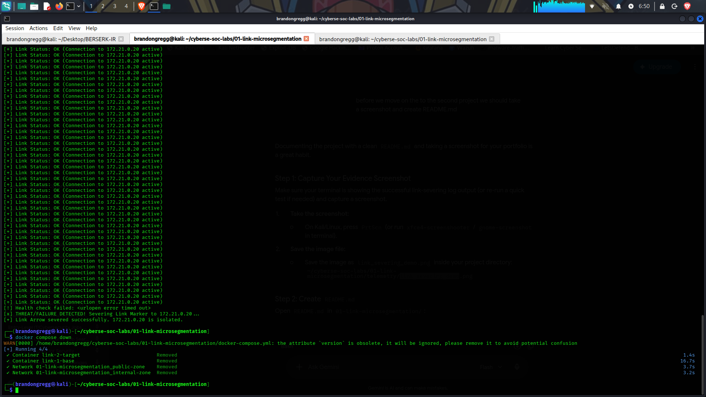

# 01-Link-Microsegmentation Pipeline

A Zero-Trust microsegmentation lab inspired by the **Yu-Gi-Oh! Cyberse / Link Summoning** archetype. This project demonstrates automated network topology isolation and health-driven firewall rule enforcement (Link Severing) using Docker networks and Python automation.

---

## 🛠️ Tech Stack & Architecture

- **Container Engine:** Docker & Docker Compose
- **Network Topologies:** Dual-homed bridge networks (`public-zone`, `internal-zone`)
- **Firewall Engine:** Linux `iptables`
- **Automation:** Python 3 (`urllib`, `subprocess`)

[ External Public Traffic ]
│
▼
┌─────────────────────────────────┐
│          link-1-base            │ (Ingress Router Node)
│  IP: 172.20.0.10 / 172.21.0.10   │
└────────────────┬────────────────┘
│  ◄── [ Dynamic Link Marker / iptables Rule ]
▼
┌─────────────────────────────────┐
│         link-2-target           │ (Protected Microservice Workload)
│         IP: 172.21.0.20         │
└─────────────────────────────────┘


---

## 🚀 Key Features

1. **Multi-Zone Isolation:** `link-2-target` is placed in an isolated internal network without direct public ingress.
2. **Active Telemetry Health Check:** `link_health_check.py` periodically probes the internal service endpoint (`http://172.21.0.20:8080`).
3. **Automated Link Severing:** Upon health check failure or threat signal, `link-1-base` executes an `iptables` drop rule targeting `172.21.0.20`, immediately isolating the target container at Layer 3/4.

---

## 📸 Lab Execution & Evidence



---

## 🧪 How to Reproduce

1. **Deploy Networks & Containers:**
   ```bash
   docker compose up -d
Load Health Monitoring Script:

Bash
docker cp scripts/link_health_check.py link-1-base:/link_health_check.py
docker exec -it link-1-base python3 /link_health_check.py
Simulate Host Compromise / Service Failure:
In a separate terminal window:

Bash
docker stop link-2-target
Observe Output:
The monitor detects the offline endpoint and executes iptables -A OUTPUT -d 172.21.0.20 -j DROP.


---

### Step 3: Tear Down Environment

Once your screenshot is saved in `telemetry/` and `README.md` is updated, tear down the containers:

```bash
docker compose down
