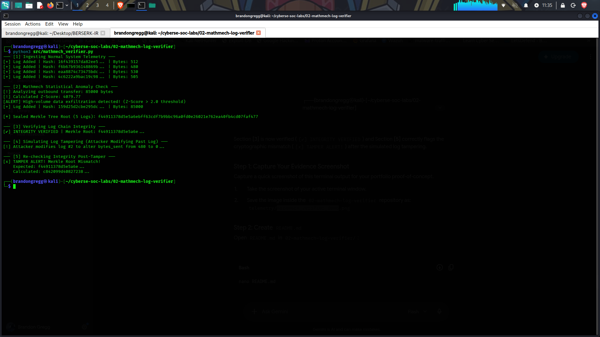

# 02-Mathmech Log Verifier

A cryptographic integrity and telemetry anomaly detection engine inspired by the **Yu-Gi-Oh! Mathmech** archetype (Equation & Matrix Operations). This tool builds a cryptographic SHA-256 Merkle Tree across system logs while running continuous Z-Score statistical analysis to flag data exfiltration spikes.

---

## 🛠️ Architecture & Concepts

1. **Statistical Anomaly Detection (Mathmech Addition/Division):** Calculates rolling mean and standard deviation across network telemetry bytes sent. Flags transfers exceeding $Z > 2.0$.
2. **Merkle Tree Cryptographic Sealing (Mathmech Multiplication):** Aggregates individual SHA-256 log hashes into a single root node.
3. **Log Integrity Verification (Mathmech Subtraction):** Re-evaluates the Merkle Root against the sealed baseline to detect unauthorized log tampering or deletion.

---

## 🚀 Key Output Features

- **Z-Score Anomaly Engine:** Flags high-volume outbound data transfers (e.g., $Z = 4079.77$).
- **Merkle Integrity Verification:** Instantly detects when a past log entry is modified, causing a cryptographic hash mismatch at the root level.

---

## 📸 Lab Execution & Evidence



---

## 🧪 How to Reproduce

1. **Run the Verifier Engine:**
   ```bash
   python3 src/mathmech_verifier.py
